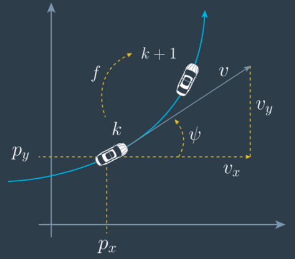
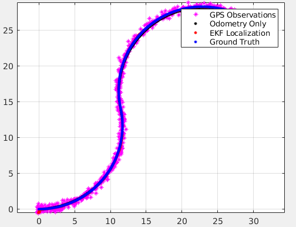
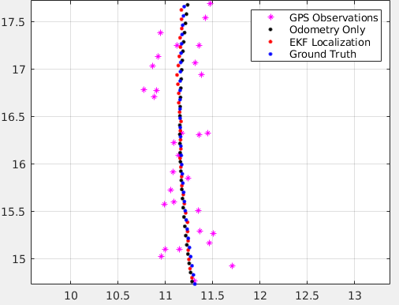
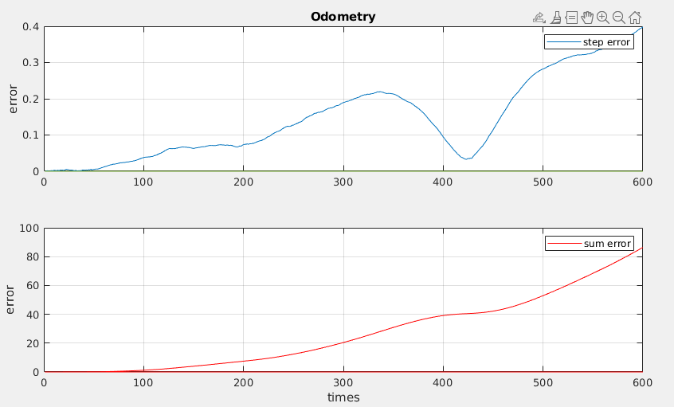
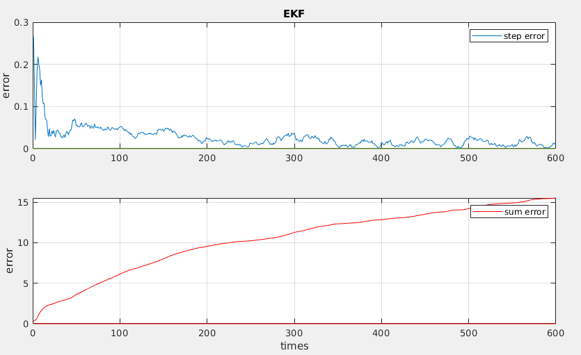

# 定位估计实践报告

小组成员：**胡天扬**    **姚利豪**    **陈季宇**


## 一、EKF原理

### 1.1 基本模型

​		**扩展卡尔曼滤波** 通过局部线性来解决非线性的问题，将非线性的预测方程和观测方程进行求导，以切线代替的方式来线性化，也就是在均值处进行一阶泰勒展开。

​		其状态方程为：
$$
x_{k}=f\left(x_{k-1}, u_{k-1}, w_{k-1}\right)
$$
​		测量方程为：
$$
z_{k}=h\left(x_{k}, v_{k}\right)
$$
​		其中 **过程噪声** $w$ 和 **测量噪声** $v$ 是相互独立的高斯白噪声，即：
$$
\begin{aligned}
p(w) & \sim N(0, Q) \\
p(v) & \sim N(0, R)
\end{aligned}
$$
​		$Q$ 和 $R$ 分别为过程噪声和测量噪声的 **协方差矩阵**，会随着状态变化。

​		根据一阶泰勒公式：
$$
T(x)=f(u)+(x-u) D f(u)+\frac{1}{2 !}(x-u)^{2} D^{2} f(u)+\ldots
$$
​		其中 $Df(x)$ 为雅克比矩阵：
$$
\begin{array}{lll}
\mathbf{J}=\left[\begin{array}{lll}
\frac{\partial \mathbf{f}}{\partial x_{1}} & \cdots & \frac{\partial \mathbf{f}}{\partial x_{n}}
\end{array}\right]=\left[\begin{array}{ccc}
\frac{\partial f_{1}}{\partial x_{1}} & \cdots & \frac{\partial f_{1}}{\partial x_{n}} \\
\vdots & \ddots & \vdots \\
\frac{\partial f_{m}}{\partial x_{1}} & \cdots & \frac{\partial f_{m}}{\partial x_{n}}
\end{array}\right]
\end{array}
$$
​		可将本题用一阶泰勒线性化展，得到状态方程和测量方程为：
$$
\begin{array}{c}
x_{k} \approx \overline{\hat{x}_{k}}+A\left(x_{k-1}-\hat{x}_{k-1}\right)+W w_{k-1} \\
z_{k} \approx \overline{z_{k}}+H\left(x_{k}-\overline{\hat{x}_{k}}\right)+V v_{k}
\end{array}
$$
​		其中 $\overline{\hat{x}_{k}}$ 表示仅仅利用过程先验知识求出的当前状态的先验状态估计，$\hat{x}_{k}$ 表示利用测量值 $z_k$ 求出的当前状态的后验状态估计。

​		$A$ 和 $H$ 则是模型 $f$ 相对于 $x$ 和 $w$ 的偏导数的雅可比矩阵，即：
$$
A_{[i, j]}=\frac{\partial f_{[i]}}{\partial x_{[j]}}\left(\hat{x}_{k-1}, 0,0\right)\\
H_{[i, j]}=\frac{\partial h_{[i]}}{\partial x_{[j]}}\left(\overline{\hat{x}}_{k}, 0,0\right)\\
$$

### 1.2 迭代公式

​		根据先验估计误差和测量误差：$e_{x_{k}}^{-} = x_{k}-\overline{\hat{x}_{k}},\ e_{z_{k}}^{-} = z_{k}-\bar{z}_{k}$，即可得到状态估计的递推式：
$$
\begin{aligned}
\hat{x}_{k} &=\overline{\hat{x}}_{k}+\hat{e}_{k} \\
&=\overline{\hat{x}_{k}}+K_{k} e_{\overline{z_{k}}} \\
&=\overline{\hat{x}_{k}}+K_{k}\left(z_{k}-\bar{z}_{k}\right) \\
&=\overline{\hat{x}_{k}}+K_{k}\left(z_{k}-h\left(\overline{\hat{x}_{k}}, 0\right)\right)
\end{aligned}
$$

​		从而就可以得到扩展卡尔曼滤波的五个基本公式：
$$
\begin{array}{cc}
\hline \text { Time Update } & \text { Measurement Update } \\
\hline \overline{\hat{x}}_{k}=f\left(\hat{x}_{k-1}, 0,0\right) & K_{k}=\bar{P}_{k} H_{k}^{T}\left(H_{k} \bar{P}_{k} H_{k}^{T}+V_{k} R V_{k}^{T}\right)^{-1} \\
\hline \bar{P}_{k}=A_{k} P_{k-1} A_{k}^{T}+W_{k} Q W_{k}^{T} & \hat{x}_{k}=\overline{\hat{x}_{k}}+K_{k}\left(z_{k}-h\left(\overline{\hat{x}_{k}}, 0\right)\right) \\
\hline& P_{k}=\left(I-K_{k} H_{k}\right) \bar{P}_{k}
\\\hline
\end{array}
$$
​		将变量名转换为实际代码中的对应量，并简化先验估计和后验估计，便于编程实现：
$$
\begin{array}{cc}
\hline \text { Time Update } & \text { Measurement Update } \\
\hline x_{k+1} = f(x_k, u_k) & K_{k}=P_{k} J_H^{T}\left(J_H P_{k} J_H^{T} + R \right)^{-1} \\
\hline P_{k+1}=J_F P_{k} J_F^{T} + Q & x_k={x}_{k}+K_{k}\left(z_{k}-h\left(x_k\right)\right) \\
\hline& P_{k}=\left(I-K_{k} J_H\right) {P}_{k}
\\\hline
\end{array}
$$
​		

## 二、CTRV模型

​		CTRV目前多用于机载追踪系统（飞机），这些二次运动模型大多假定速度 $v$ 和 偏航角速度 $ω$ 没有关系，因此，在这类运动模型中，由于偏航角速度测量的扰动，即使车辆没有移动，我们的运动模型下的角速度也会发生细微的变化。



​		在CTRV中，目标的状态量为：
$$
\vec{x}(t)=\left(\begin{array}{x}
x & y & v & \theta & \omega
\end{array}\right)^{T}
$$
​		对本题而言，目标的状态量为：
$$
\vec{x}(t)=\left(\begin{array}{x}
x & y & \theta
\end{array}\right)^{T}
$$
​		观测量为：	
$$
\vec{z}(t)=\left(\begin{array}{z}
v_x & v_y & \omega
\end{array}\right)^{T}
$$
​		易知：
$$
v = \sqrt{v_x^2+v_y^2}
$$
​		其中，$\theta$ 为偏航角，是追踪的目标车辆在当前车辆坐标系下与x轴的夹角，逆时针方向为正，取值范围是$[0,2\pi)$, $ \omega$是偏航角速度。

​		由此可得CTRV的状态转移函数为：
$$
\vec{x}(t+\Delta t)=\left(\begin{array}{c}
\frac{v}{\omega} \sin (\omega \Delta t+\theta)-\frac{v}{\omega} \sin (\theta)+x(t) \\
-\frac{v}{\omega} \cos (\omega \Delta t+\theta)+\frac{v}{\omega} \cos (\theta)+y(t) \\
\omega \Delta t+\theta
\end{array}\right)
$$
​		若 $\omega=0$，此时车辆实际上是直线行驶的，则状态转移函数就变为：
$$
\vec{x}(t+\Delta t)=\left(\begin{array}{c}
v \cos (\theta) \Delta t+x(t)\\
v \sin (\theta) \Delta t+y(t)\\
\omega
\end{array}\right)
$$
​		本题中 $w\neq0$，所以使用第一个模型，而该模型中的状态变换是非线性的，因此要用到 $EKF$ 进行求解。

​		在CTRV模型中，对各个元素求偏导数可以得到雅可比矩阵$(\omega \neq 0)$
$$
J_{F}=\left[\begin{array}{cccc}
1 & 0 & \frac{v}{\omega}(-\cos (\theta)+\cos (\Delta t \omega+\theta))\\
0 & 1 & \frac{1}{\omega}(\cos (\theta)-\cos (\Delta t \omega+\theta))\\
0 & 0 & 1
\end{array}\right]\\
J_{H}=\left[\begin{array}{cccc}
1 & 0 & 0\\
0 & 1 & 0\\
0 & 0 & 1
\end{array}\right]
$$
​		至此，除了协方差矩阵外， $EKF$ 中的所有变量都已确定。


## 三、代码实现

### 3.1 运动模型和观测模型

​		根据CTRV模型即可获得状态方程：

```matlab
function x = doMotion(x, u)
    global dt;
    v = sqrt(u(1)^2 + u(2)^2);    w = u(3);    theta = x(3);
    x(1) = x(1) - v/w*sin(theta) + v/w*sin(theta+w*dt);
    x(2) = x(2) + v/w*cos(theta) - v/w*cos(theta+w*dt);
    x(3) = x(3) + dt * w;
```

​		由 $EKF$ 的推导获得测量方程：

```matlab
function x = doObservation(z, xPred, K)
    x = xPred + K * (z-xPred);
```

### 3.2 雅克比矩阵

* 可以直接根据CTRV的推算结果进行求解：

```matlab
    jF=[1 0 v/w*(-cos(theta)+cos(dt*w+theta)); 
        0 1 1/w*(cos(theta)-cos(dt*w+theta));
        0 0 1];
```

* 也可以用matlab自带的求解函数，并结合符号变量进行代换：

```matlba
     f = [x - v/w*sin(theta) + v/w*sin(theta+w*dt); 
         y + v/w*cos(theta) - v/w*cos(theta+w*dt);
         theta + dt * w];
     J = jacobian(f, [x y theta]);
     jF = subs(J, [x y theta], X);
```

### 3.3 EKF迭代

​		根据 $EKF$ 的五个基本公式，并将雅克比矩阵单独计算，即可得到以下七个方程：

```matlab
% Predict   
xPred =  doMotion(xEkf, u);         % 根据系统模型得到先验估计值
JF = jacobF(xEkf, u);               % 计算雅克比矩阵JF
PxEkf = JF * PxEkf * JF' + convQ;   % 预测误差的协方差矩阵

% Update
JH = jacobH(xPred);                             % 计算雅克比矩阵JH
K = PxEkf * JH' * (JH*PxEkf*JH' + convR)^-1;    % 计算卡尔曼增益
xEkf = doObservation(z,xPred,K);                % 根据测量值更新观测值
PxEkf = (eye(3) - K*JH) * PxEkf;                % 更新误差的协方差矩阵
```

### 3.4 初值和协方差矩阵的确定

* P

​		一般来说，只要 $P_0$ 不设置为零，$EKF$ 都能很好地收敛，若将初值设为零，会导致最后所有估计的状态都为零。在本题中设为单位阵。

* convR

​		测量协方差衡量的是测量误差。convR越大，说明测量误差越大，意味着不能相信测量值，估计过程中偏向测量值的趋势就会变小。相反，convR越小，说明测量误差越小，测量值可信度越高，在估计过程中就会有偏向测量值的波动。

​		但是一般来说，convR不宜过大，因为初始的状态估计值往往是不正确的，若convR过大，会导致系统偏移减小得很慢，

* convQ

​		过程协方差衡量的是过程误差，也就是模型的准确度。convQ越大，说明系统的模型越不准确，那么过程方程的作用就会减小，所以一般来说convQ都会设置成很小的数，表明过程的变化符合已知的状态方程。


## 四、结果分析

​		由于里程计的误差只与随机数有关，因此不纳入统计。以下列出部分参数的EKF误差：

| convQ                        | convR                   | error_EKF                                  | mean       |
| ---------------------------- | ----------------------- | ------------------------------------------ | ---------- |
| noiseQ.^2                    | noiseR.^2               | 0.0334; 0.0474; 0.0409; 0.0298; 0.0325     | 0.0368     |
| noiseQ                       | noiseR                  | 0.1002; 0.0974; 0.1016; 0.0517; 0.0566     | 0.0815     |
| eye(3)                       | eye(3)                  | 0.2093; 0.2148; 0.2158; 0.2126; 0.2016     | 0.2108     |
| noiseQ * noiseQ'             | noiseR * noiseR'        | 0.0366; 0.0315; 0.0398; 0.0391; 0.0459     | 0.0386     |
| 0.1 .* noiseQ * noiseQ'      | noiseR * noiseR'        | 0.0269; 0.0455; 0.0375; 0.0231; 0.0303     | 0.0327     |
| 0.5 .* noiseQ * noiseQ'      | noiseR * noiseR'        | 0.0302; 0.0473; 0.0417; 0.0260; 0.0305     | 0.0351     |
| **0.05 .* noiseQ * noiseQ'** | **noiseR * noiseR'**    | **0.0243; 0.0263; 0.0244; 0.0226; 0.0179** | **0.0231** |
| 0.05 .* noiseQ * noiseQ'     | 0.5 .* noiseR * noiseR' | 0.0203; 0.0332; 0.0326; 0.0448; 0.0239     | 0.0310     |

​		加粗行的参数得到的EKF效果最佳，放大后也几乎与真值完全重合。效果如下：





​		里程计的单步误差和总误差如下，可以看到在转弯处里程计的单步误差减小，而当运动模型变化不改变时单步误差会累计。



​		EKF的初始误差与初值有关，然后会迅速收敛，从而使得均值误差比里程计小。




## 五、总结

​		**EKF定位估计** 感觉是三个作业中最容易的，考试周结束以后三个人聚在一起用了一天时间谈论完成，所以没有明确分工。原理部分的主要难点在于分清估计值和测量值，有些参考文件没有将两者区分得很清楚；编程上没有遇到太大的困难，只要理解了每个变量的含义，对照公式编写即可。最后还有一点是 `Q` 和 `R` 的选取，在报告中已有说明。


## 六、参考

[卡尔曼滤波详解](https://blog.csdn.net/honyniu/article/details/88697520?spm=1001.2014.3001.5501)

[卡尔曼滤波示例](https://blog.csdn.net/honyniu/article/details/88698442?spm=1001.2014.3001.5501)

[扩展卡尔曼滤波详解](https://blog.csdn.net/honyniu/article/details/109707123?spm=1001.2014.3001.5501)

[EKF理论讲解与实例](https://blog.csdn.net/O_MMMM_O/article/details/106078679)
